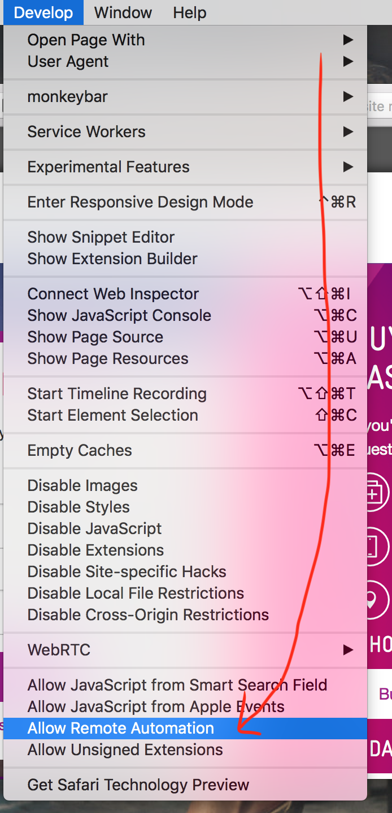

# Selenium Telstra Air autologin
This is simple script to automatically log in to Telstra Air with your username and password.

Tested on MacOS High Sierra with Safari browser and python3.

## Requirements
- Selenium server: `brew install selenium-server-standalone`
  - problems can occurs with permissions to do linking. In this case you need to
    run:
    ```
    sudo mkdir /usr/local/Frameworks
    sudo chown $(whoami):admin /usr/local/Frameworks
    brew link python3
    ```
- python3 selenium webdriver: https://pypi.org/project/selenium/ (when
  installing python3 using brew it will came with pip but it's hidden in
  `/usr/local/Cellar/python/3.7.0/Frameworks/Python.framework/Versions/3.7/bin/pip`
- Safari with 'Allow Remote Automation' enabled. Instruction below.

# Safari

## Enable 'Allow Remote Automation' option

1. Enable Developer mode in Safari settings.
  
1. Allow remote automation in drop down menu.
  

# Example usage
`./autologin.py username password`

# Installation script
You can make this script run on background and be executed every time you're
connected to Telstra Air network. Run `install.sh` script with your username and
password as a parameters and it will do the trick.

```
chmod +x install.sh
./install.sh username password
```
